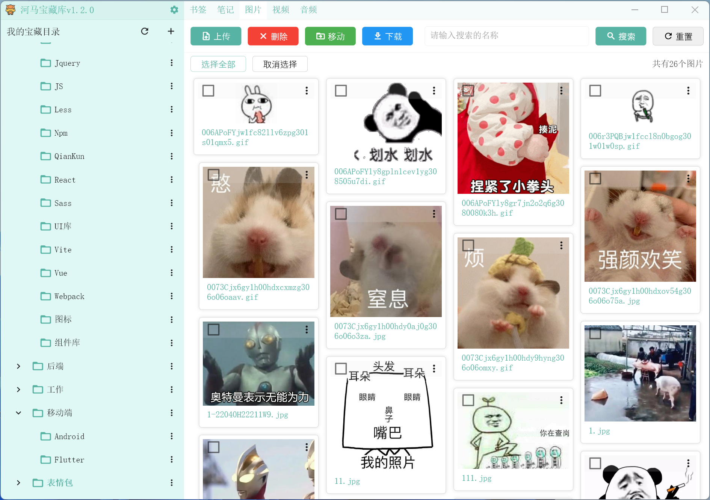

# 河马宝藏库

一个基于flutter的桌面应用。

# 环境
需要支持windows桌面开发的flutter环境。

# 更新记录
*  2022-05-28 
   * 升级成flutter3.0
* 2022-05-29 
  * 笔记中添加pdf创建与上传功能
  * 笔记中添加备忘功能
* 2022-05-30
  * 更换托盘组件
* 2022-06-01
  * 笔记中备忘功能添加markdown支持
* 2022-06-02
  * 添加其它文件功能

# 项目截图

 

 

 

 

 

 

 

# 联系
有疑问可联系QQ：332557712

